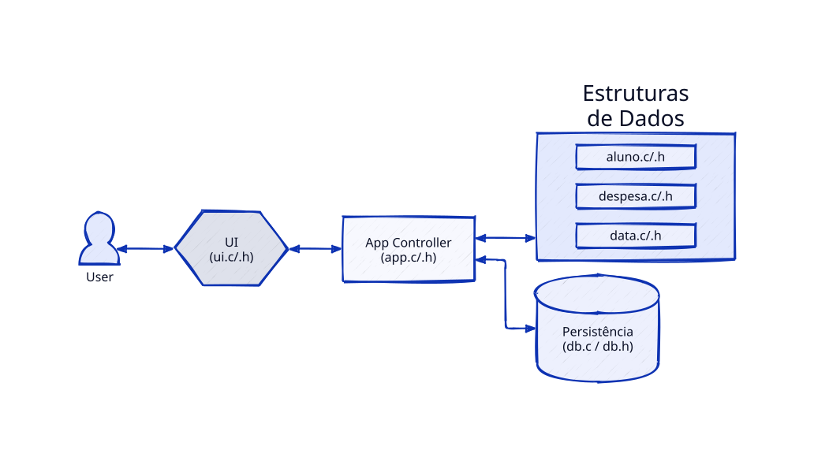

# Projeto PPP 2025/26

Implementação didática de um sistema simples para gestão de conta de bar de alunos.

## Arquitetura 




- `src/ui.c/.h`: interface em terminal (menu e leitura de dados).
- `src/app.c/.h`: lógica de aplicação (operações principais).
- `src/aluno.c/.h`, `src/despesa.c/.h`, `src/data.c/.h`: estruturas de dados e validações.
- `src/db.c/.h`: persistência em ficheiros texto.

## Funcionalidades

1. Inserir aluno.
2. Eliminar aluno.
3. Listar alunos por ordem alfabética.
4. Registar despesa de um aluno.
5. Carregar saldo de um aluno.

## Persistência

Os dados são carregados no arranque e guardados ao sair:

- `db/alunos.txt`
- `db/despesas.txt`

Formato `alunos.txt`:

`numero;nome;curso;ano;dd/mm/aaaa;saldo`

Formato `despesas.txt`:

`numero_aluno;valor;descricao;dd/mm/aaaa`

## Compilação e execução

```bash
make all
./bin/projectoppp
```

## Testes

```bash
make test
```

## Scripts de simulação

Para facilitar demonstrações e validação com dados persistidos:

```bash
scripts/reset_db.sh
scripts/seed_db.sh
scripts/simular_utilizacao.sh
scripts/validar_cenario.sh
```

- `reset_db.sh`: limpa os ficheiros de base de dados.
- `seed_db.sh`: popula a base com alunos e despesas fabricadas.
- `simular_utilizacao.sh`: executa automaticamente um cenário completo no menu:
  inserir aluno, carregar saldo, registar despesa, eliminar aluno e listar.
- `validar_cenario.sh`: verifica se os resultados esperados ficaram persistidos nos ficheiros `db/`.
